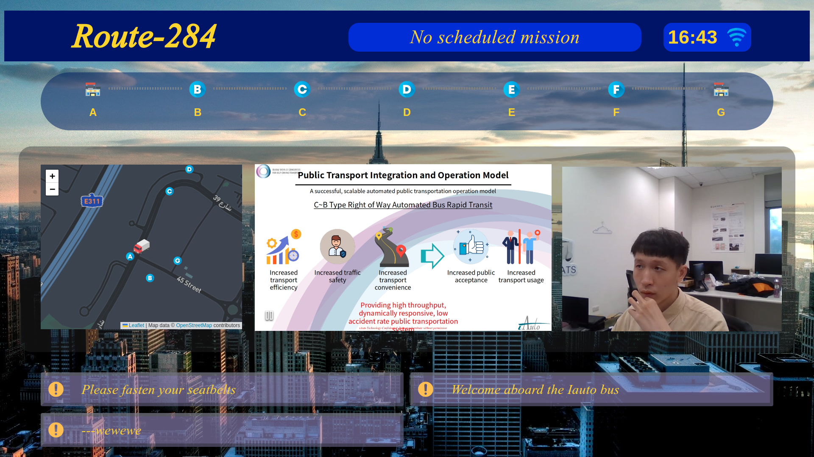
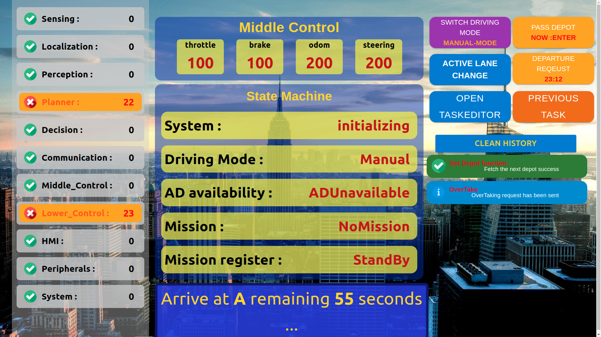

# Readme
This repository contains the HMI developed by the lab team for the Dubai World Congress 2023. 

It includes UI for both drivers and passengers and utilizes ROS2 for simulation during the development process. The entire project is built using React.js + mui as the frontend library, and ROSJSLIB is employed for communication with the ROS2 core system."

### Passenger UI   

Basic interface is displayed inside the bus compartment, providing passengers with basic information on the bus, as well as the screen outside the bus and the map location.

### Driver UI 

The monitoring panel on the driver’s seat provides all subsystem status and decision-making state machine status display, as well as task editing and some Level 3 operations determined by the driver.

